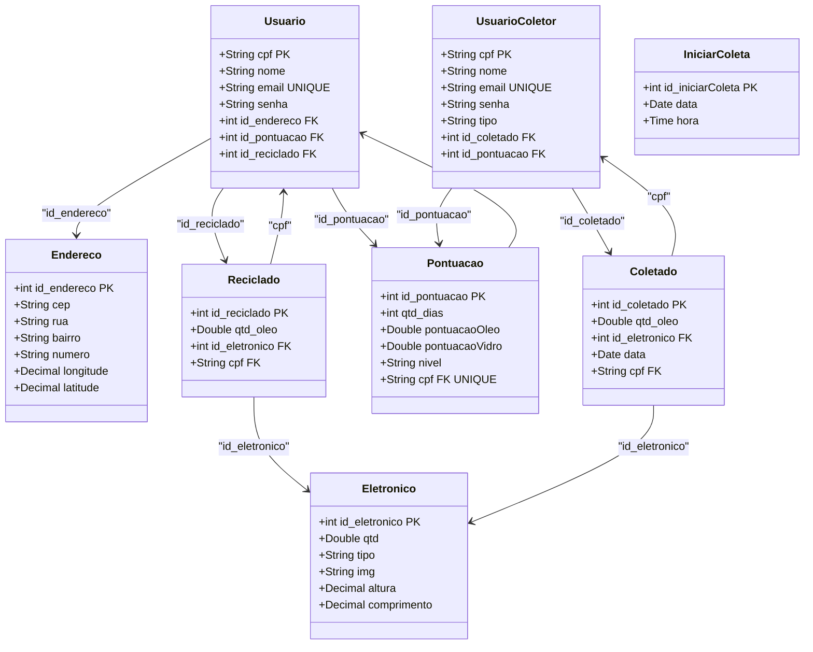

# Recolhe.ai
repositório destinado para o projeto final do SENAI

```mermaid
classDiagram
    class Usuario {
      +String cpf PK
      +String nome
      +String email UNIQUE
      +String senha
      +int id_endereco FK
      +int id_pontuacao FK
      +int id_reciclado FK
    }

    class Endereco {
      +int id_endereco PK
      +String cep
      +String rua
      +String bairro
      +String numero
      +Decimal longitude
      +Decimal latitude
    }

    class UsuarioColetor {
      +String cpf PK
      +String nome
      +String email UNIQUE
      +String senha
      +String tipo
      +int id_coletado FK
      +int id_pontuacao FK
    }

    class Reciclado {
      +int id_reciclado PK
      +Double qtd_oleo
      +int id_eletronico FK
      +String cpf FK
    }

    class Pontuacao {
      +int id_pontuacao PK
      +int qtd_dias
      +Double pontuacaoOleo
      +Double pontuacaoVidro
      +String nivel
      +String cpf FK UNIQUE
    }

    class Coletado {
      +int id_coletado PK
      +Double qtd_oleo
      +int id_eletronico FK
      +Date data
      +String cpf FK
    }

    class Eletronico {
      +int id_eletronico PK
      +Double qtd
      +String tipo
      +String img
      +Decimal altura
      +Decimal comprimento
    }

    class IniciarColeta {
      +int id_iniciarColeta PK
      +Date data
      +Time hora
    }

    Usuario --> Endereco : "id_endereco"
    Usuario --> Pontuacao : "id_pontuacao"
    Usuario --> Reciclado : "id_reciclado"
    UsuarioColetor --> Coletado : "id_coletado"
    UsuarioColetor --> Pontuacao : "id_pontuacao"
    Reciclado --> Eletronico : "id_eletronico"
    Reciclado --> Usuario : "cpf"
    Pontuacao --> Usuario : "cpf"
    Coletado --> Eletronico : "id_eletronico"
    Coletado --> UsuarioColetor : "cpf"

```
