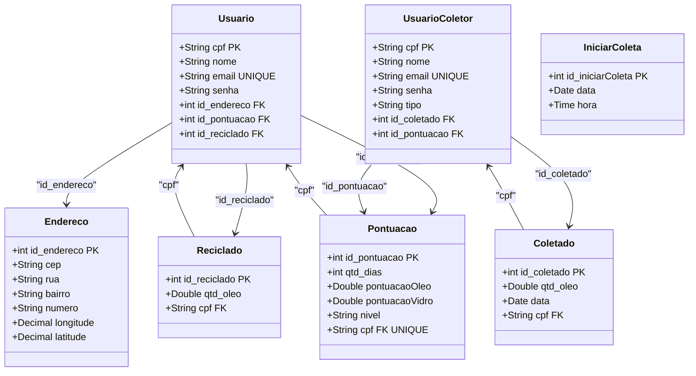
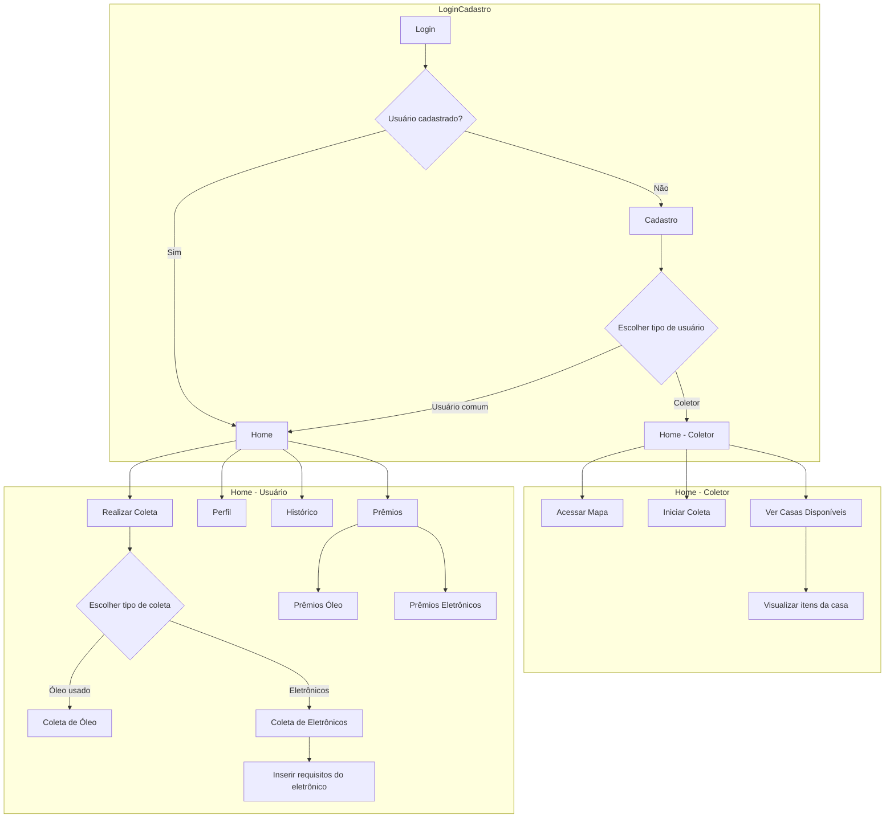
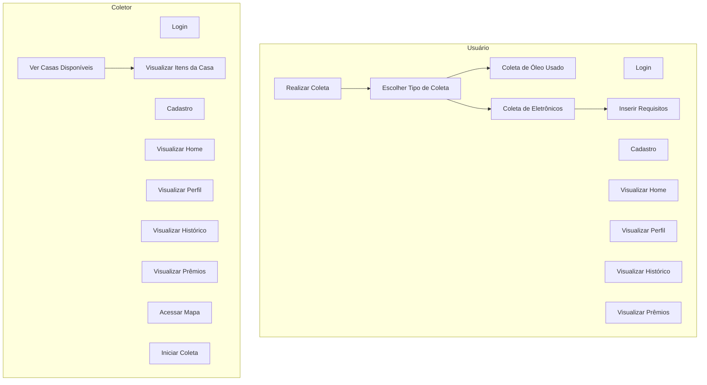

<br>
<br>
<br>
<p align="center">
   
</p>

<p align="center">
   
  
  
  
</p>
<hr>
<br>
<br><br><br>


</a>

- [Contexto Inicial](#contexto-inicial)
- [Problema Encontrado](#problema-encontrado)
- [Nossa Solução](#nossa-solução)
- [Protótipos](#protótipos)
- [Diagramas](#diagramas)
- [Funcionalidades do Aplicativo](#funcionalidades-do-aplicativo)
- [Ferramentas de Desenvolvimento](#ferramentas-de-desenvolvimento)
- [Referências](#referências)
- [Equipe de Desenvolvimento](#equipe-de-desenvolvimento)
<br><br><br>

</a>
## Apresentação do Projeto: Desenvolvimento de Aplicativo sobre Coleta Seletiva de Óleo

### Contexto Inicial
Aqui vai a descrição do contexto inicial.
<br><br><br>

</a>
## Problema Encontrado
Aqui vai a descrição do problema encontrado.
<br><br><br>


</a>
## Nossa Solução
Aqui vai a descrição da solução.
<br><br><br>

</a>
## Protótipos
Aqui vai a descrição dos protótipos.
<br><br><br>

</a>
## Diagramas

### Diagrama de Classe:

<br><br>
### Diagrama de Fluxo

<br><br>
### Diagrama de Uso:


<br><br><br>

</a>
## Funcionalidades do Aplicativo
<details>

<summary> Cadastro de Usuário </summary>

# Cadastro de Novo Usuário

Esta funcionalidade permite cadastrar novos usuários no sistema com informações adicionais como nome e CPF. A implementação inclui validação de campos na interface do usuário e tratamento de erros durante a criação do usuário e o armazenamento de dados no Firebase.

---

## Validação de Campos

Antes de enviar os dados, é realizada uma validação para garantir que todos os campos obrigatórios estejam preenchidos corretamente. 

### Validações Implementadas
1. **Nome:** Não pode estar vazio.
2. **Email:** Não pode estar vazio e deve ser um formato válido.
3. **Senha:** Deve conter pelo menos 6 caracteres.
4. **Confirmação de Senha:** Deve corresponder à senha informada.
5. **CPF:** Não pode estar vazio e deve existir.

Caso algum campo não seja válido, uma mensagem de erro é exibida, orientando o usuário a corrigir o problema.

---

## Tratamento de Erros com `try-catch`

A lógica de cadastro utiliza um bloco `try-catch` para tratar erros durante o processo de registro. Isso garante que, caso ocorra uma falha, o sistema não trave e o erro possa ser identificado e exibido.

### Fluxo no Bloco `try`
1. **Criação do Usuário:** Os dados de autenticação são enviados ao Firebase Authentication.
2. **Armazenamento no Firestore:** Após a criação bem-sucedida do usuário, as informações adicionais (nome, CPF, email, data de criação) são salvas no Firestore.

### No Bloco `catch`
- Caso ocorra um erro em qualquer etapa (autenticação ou armazenamento), o erro é capturado e registrado no console para depuração.
- Um retorno `null` é enviado para indicar falha no processo.
- FirebaseAuthException: Erros relacionados ao Firebase Authentication, como email já cadastrado ou senha inválida.
- FirestoreException: Erros relacionados ao armazenamento de dados no Firestore.
- Outros Erros Genéricos: Erros inesperados são tratados e registrados para análise.

</details>


<details>

<summary> Login </summary>

# Login
Este código implementa a funcionalidade de login com Firebase Authentication e Firestore. Além disso, determina a página para onde o usuário será redirecionado após o login.

1. Entrada de Dados: 
O usuário fornece email e senha nos campos correspondentes.

2. Validação: 
Os campos de entrada possuem validação para garantir que não estejam vazios.

3. Autenticação:
O método _authService.signInWithEmail realiza a autenticação com Firebase Authentication.

Caso o login seja bem-sucedido, o objeto User contendo informações do usuário autenticado é retornado.

- Caso o campo imagem do firestore do usuário esteja vazio ou seja null, o usuário é redirecionado para a página de configuração de ícone (SetIconScreen). Isso força o usuário a selecionar um ícone antes de acessar outras funcionalidades.
- Caso o campo imagem tenha um valor válido, o usuário é redirecionado diretamente para a página inicial (HomePage)

**Outros Pontos:**
1. CustomTextField:
Um componente reutilizável para campos de entrada com validação e personalização visual.

2. GradientButton:
Um botão com estilo de gradiente e bordas arredondadas, reutilizável em diferentes telas.

</details>


<details>

<summary> Seleção de Ícone </summary>

# Tela de Ícones
O código implementa a funcionalidade de permitir que o usuário selecione um ícone e salve essa escolha no banco de dados Firestore, com as seguintes etapas:

1. Exibição das Opções de Ícones:
Uma lista de URLs é usada para exibir os ícones disponíveis.
O índice do ícone selecionado é armazenado na variável selectedIndex.

2. Quando o usuário clica em um ícone, o evento onTap é disparado.
A seleção atualiza o estado (setState) para destacar o ícone escolhido.

3. O botão "Confirmar Seleção" só é habilitado se selectedIndex não for null, garantindo que o usuário escolha um ícone antes de prosseguir.

4. Ao confirmar a escolha, o código usa a coleção users no Firestore.
A imagem escolhida é atualizada no documento do usuário identificado por userId.

```dart
await FirebaseFirestore.instance
    .collection('users')
    .doc(widget.userId)
    .update({'imagem': imageUrls[selectedIndex!]});
```

**Pontos Importantes**
1. Validação e Estado:
O botão de confirmação fica desabilitado (null) até que uma escolha válida seja feita.
2. Firebase:
A atualização no Firestore é feita de forma assíncrona(async), garantindo que a operação seja concluída antes de navegar para a próxima tela.

</details>


<details>

<summary> Cadastro de Endereço </summary>

# Cadastro de Endereço
O código a seguir é da página onde o usuário pode cadastrar um endereço, utilizando o `CEP` para buscar informações como rua e bairro através da `API ViaCEP`. Após o preenchimento, os dados são salvos no Firestore na subcoleção endereco dentro do documento do usuário autenticado no Firebase Authentication.

1. Busca pelo CEP:
Utiliza a API ViaCEP para buscar endereço pelo CEP fornecido.
Preenche automaticamente os campos "Rua" e "Bairro".

2. Validação de Campos:
Valida se os campos estão preenchidos corretamente (CEP com 8 dígitos, rua, bairro e número não vazios).

3. Salvar no Firestore:
Salva os dados do endereço na subcoleção endereco do usuário autenticado.

4. Mensagens de Erro e Sucesso:
Exibe mensagens claras de erro (como CEP inválido ou falha na conexão) e confirmações de sucesso após salvar.

</details>


<details>

<summary> Cadastro de Itens </summary>

# Cadastrar Óleo no Firebase


</details>

<details>

<summary> Traçar Rotas </summary>

# Traçar Rotas entre pontos com Google Maps

</details>


<details>

<summary> Pontuação </summary>

# Pontuação

</details>
<br><br><br>

</a>
## Ferramentas de Desenvolvimento
 <p>  
      
  <table>
  <thead>
    <tr>
      <th> Linguagens </th>
      <th> Frameworks </th>
      <th> Outros </th>
    </tr>
  </thead>
  <tbody>
    <tr>
      <td align="center">  </td>
       <td align="center">  </td>
        <td align="center">  </td>
    </tr>
     <tr>
         <td align="center"> </td>
         <td align="center">  </td>
         <td align="center">  </td>
      </tr>
    <tr>
      <td align="center"> </td>
        <td align="center"> </td>
        <td align="center">  </td>
    </tr>
    <tr>
      <td align="center">  </td>
      <td align="center"> </td>
       <td align="center">  </td>
    </tr>
  </tbody>
</table>
   </p>
</p>
<br><br><br>

</a>
## Referências

* ### Fontes de Pesquisa para Desenvolvimento do Problema:
    - [G1 - Notícia sobre acúmulo de lixo e mato alto na praça de Limeira](https://g1.globo.com/sp/piracicaba-regiao/noticia/2023/12/25/sem-manutencao-praca-de-limeira-tem-mato-alto-acumulo-de-lixo-e-gera-transtornos-a-moradores.ghtml)
    - [Prefeitura faz Contrato Emergencial para limpeza pública](https://diariodejustica.com.br/prefeitura-de-limeira-faz-contrato-emergencial-de-r-209-milhoes-para-limpeza-publica/)
    - [Resíduos no Brasil não são reaproveitados](https://g1.globo.com/jornal-nacional/noticia/2023/05/17/dia-mundial-da-reciclagem-96percent-dos-residuos-produzidos-no-brasil-nao-sao-reaproveitados.ghtml)
    - [Vídeo sobre a Coleta Seletiva de Limeira](https://www.facebook.com/prefeituralimeira/videos/a-coleta-seletiva-realizada-em-limeira-percorre-v%C3%A1rias-regi%C3%B5es-da-cidade-o-servi/754470765802787/)

* ### IA's Utilizadas:
    - [ChatGPT 3.5](https://chat.openai.com/)
    - [Claude AI](https://claude.ai/login?returnTo=%2F%3F)
    - [Gama App](https://gamma.app/pt-br)
    - [Bing - Image Creator](https://www.bing.com/images/create)
 
* ### UX/UI:
  - [Figma](https://www.figma.com/)
  
<br><br><br>

</a>
## Equipe de Desenvolvimento
<div align=center>
  <table style="width: 100%">
    <tbody>
      <tr align=center>
        <th><strong> Heitor Rodrigo de Melo Silva </br> Hunter7210 </strong></th>
        <th><strong> João Victor de Lima </br> JoaovlLima </strong></th>
        <th><strong> Rafael Souza de Moura </br> rafaelmoura23</strong></th>
         <th><strong> Vinícius Granço Feitoza </br> epicestudar </strong></th>
      </tr>
      <tr align=center>
        <td>
          <a href="https://github.com/Hunter7210">
            
          </a>
        </td>
        <td>
          <a href="https://github.com/JoaovlLima">
            
          </a>
        </td>
         <td>
          <a href="https://github.com/rafaelmoura23">
            
          </a>
        </td>
         <td>
          <a href="https://github.com/epicestudar">
            
          </a>
        </td>
      </tr>
    </tbody>

  </table>
</div>
